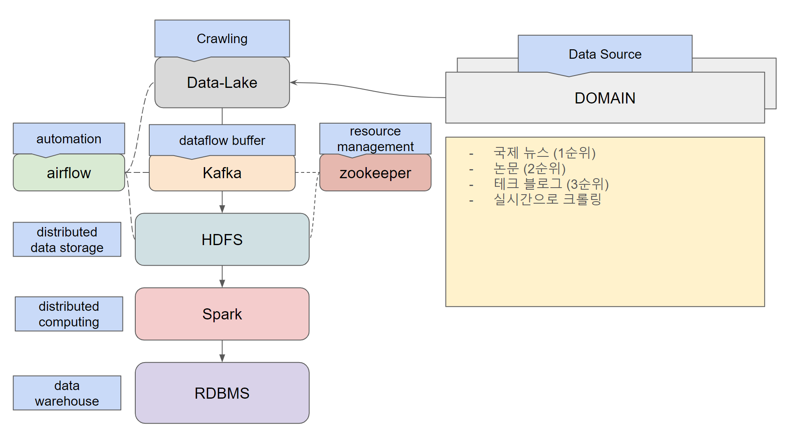

# DE31-3rd_team5
## Objective
The objective of this mini-project is to build fundamental backgrounds for final project during 31st Data Engineering Course of Playdata Coding Bootcamp.

## Overview on Project Architecture


|Framework|Purpose on Usage|
|---|---|
|Python|Basic Language used during project|
|HDFS|Data Lake on clustered computers|
|Kafka|For buffering large data to be delivered into HDFS for sure.|
|Spark|Executing EDA on large data under distributed computing environment.|
|MySQL(MariaDB)|For storing analyzed data and gain fast access.|
|Airflow|For automating each data crawl-store-analysis processes.|

## Environment Summary
- Python 3.10.12
- Spark 3.5.1
- Hadoop 3.3.6
- Kafka 2.13-3.2
- mariadb-lts 11.2.4-1

## Installation
### 1. Hadoop
The Hadoop cluster used within project is pre-built cluster; thus I won't explain about ways to instal hadoop and for cluster on this document.

Try following this [official tutorial](https://hadoop.apache.org/docs/stable/hadoop-project-dist/hadoop-common/SingleCluster.html) for quick start!

### 2. Spark
We combined 2 machines with 16GB RAM and 4 core, 1 machine with 12GB RAM and 4 core to form a Spark Cluster; but I recommend using machines with more RAM for better envoironment and computing power.

Installation process was rather simple.
1) Download Spark tar file from [official website](https://dlcdn.apache.org/spark/spark-3.5.1/spark-3.5.1-bin-hadoop3.tgz)

You can also do this on terminal using **wget**.

```bash
wget https://dlcdn.apache.org/spark/spark-3.5.1/spark-3.5.1-bin-hadoop3.tgz
```
2) Unzip the downloaded tar file and locate it to somewhere you'll be okay for it to be at.

For example, I renamed unzipped file in simple "spark" and placed it under /opt/ directory.

You can use **tar** command and **mv** command on this process.

```bash
tar xvfz spark-3.5.1-bin-hadoop3.tgz
sudo mv spark-3.5.1-bin-hadoop3 /opt/spark/
sudo chown -R hadoop:hadoop /opt/spark/
```

Remember to change it's ownership to account you current are trying to use spark.

3) Set up environment variables.